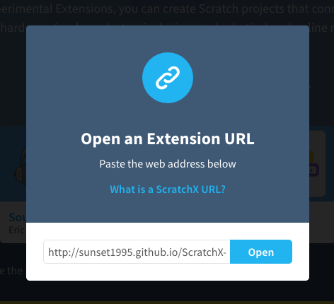
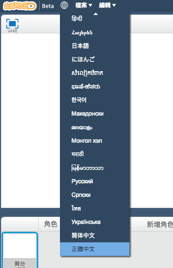
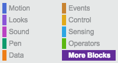
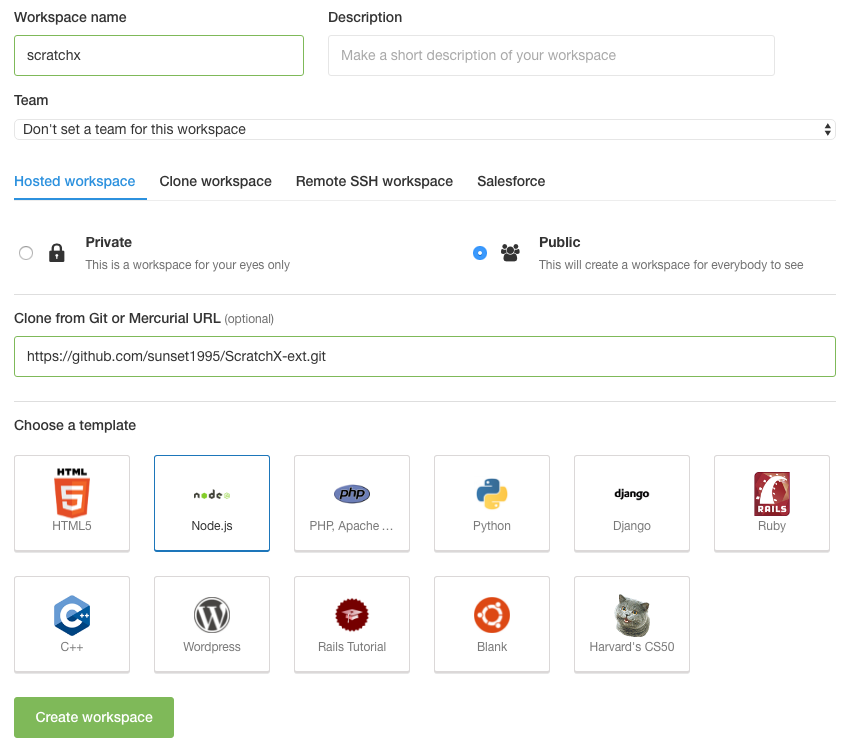
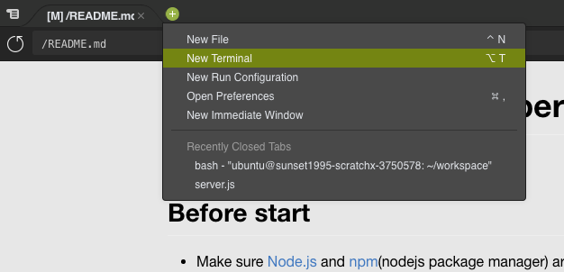
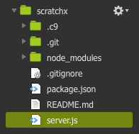
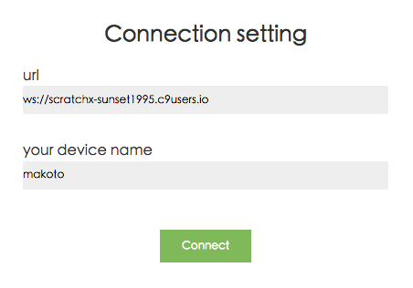

# ScratchX websocket extension

> 注意：不是所有 ScratchX extension 都是安全的，使用前請先確定來源是可信的！

ScratchX websocket extension 可讓 ScratchX 透過 websocket 與伺服器做即時溝通。此外，附有一個網頁可讀取手機重力感應器的資訊傳到伺服器上讓 ScratchX 讀取。  
這篇會包含：
- ScratchX websocket extension 使用說明
- 利用 c9 架設自己的伺服器
- 網頁讀取重力感應器說明

各網頁傳送門(aka 連結)：
- [ScratchX 官網](http://scratchx.org/)
- [c9.io 官網](https://c9.io/)
- [ScratchX websocket extension](http://sunset1995.github.io/ScratchX-ext/extensions/ws.js)
- [讀取手機重力感應器的網頁](http://sunset1995.github.io/ScratchX-ext/static/gsensor.html)

## ScratchX websocket extension 使用說明
進入 [ScratchX 官網](http://scratchx.org/) 點選 _Open Extension URL_  
將 ScratchX websocket extension 網址 `http://scratchx.nctu.me/extensions/ws.js` 貼於欄位中，按下 _Open_（如下圖）  
  

若你想要更改成中文版面，可點選畫面左上方的地球按鈕，拉到最下面選取 _正體中文_（如下圖），以下示範會採用英文版面  
  

點選 _More Block_ 即可看到此 extension 提供的方塊（見下圖）  
  

  
初始化連線，設定你的名字為 _某人_(請改成你自己的，建議只由英文跟數字組成) 並連接到位於 _url_ 的伺服器。  
這個方塊只有在尚未成功連線時被執行才會發揮效用。  
__注意__，這個方塊會卡住程式的執行直到連線成功或失敗。  

  
如果你已經成功連線會得到 _1_ 否則得到 _0_  

  
連線後你可以更改你自己的屬性，_屬性_ 你可以任意取（建議只由英文跟數字組成）也可以有很多個，如：_x_、_y_、_vx_、_vy_、_handsome_、_cute_ 之類的屬性  
_值_ 為該屬性的值，如：_a_ = _9.8_ 此處 _9.8_ 即為屬性 _a_ 的值  
你只能操作你自己的屬性  

  
只要他們知道你連線時設定的名字，你所有的屬性都可以讓別人透過此方塊讀取  
同樣的，你只要知道別人是用什麼名字連線伺服器，你也可以讀取他們的任何屬性  

> FYI：  
> 為了讓網路上的設備能順利溝通，有一群人溝通好後制定了一套溝通模式稱為通訊協定（protocol）。網路設備都會遵循通訊協定以方便完成溝通，網路溝通有很多種通訊協定，而 websocket 為通訊協定的一種。  

## 利用 c9 架設自己的伺服器
請先跟本課程[登記](https://goo.gl/forms/gGBU4VakhcMdlTUA2)獲得邀請後註冊 c9，完成後請進入 [c9.io 管理介面](https://c9.io/)  
點選灰色的大按鈕 _Create a new workspace_  
填妥下面的表單建立一個 workspace，其中要留意的有：
- Workspace name：此為必填欄位
- 建議不要選擇 Private，每個人只能建立一個 Private workspace
- __!!__Clone from Git or Mercurial URL__!!__：請填上 _https://github.com/sunset1995/ScratchX-ext.git_
- Choose a template：請選擇 Node.js  
  

建立好後你會得到一個工作環境（其實就是一台電腦），你可以在上面寫 code 執行，做各種事情。這邊只會介紹如何讓伺服器跑起來。  
請按下 __+__ 按鈕並選取 __New Terminal__  
  
你可以透過 Terminal 操作你位於 c9 上的電腦，只是不同於平常圖形介面，這邊你只能透過輸入指令來操作它。  

這邊的伺服器是一隻叫 _server.js_ 的程式，執行後會開始傾聽 （listen）來自客戶端 （client，在這邊也就是 ScratchX）的請求，提供服務。  
_server.js_ 這支程式仰賴許多 Open Source 的套件，讓我們可以用很短的程式碼就開發出來。  
所以在執行前，請先在 terminal 下 `npm install --save` 安裝好仰賴的套件們（dependency）。  
  

裝好後即可執行 _server.js_ 了，有兩種方法：  
其一：在 terminal 下 `node server.js` 指令  
其二：在左邊的側邊欄找到 _server.js_ 點兩下打開檔案（見下圖）
  
打開的程式碼即為 _server.js_，之後再按下上方欄的 _Run_ 按鈕即可執行（見下圖）  
  

執行後，畫面中第一行為你伺服器的 url（見下圖）  
  

## 網頁讀取重力感應器說明
請用手機打開 [讀取手機重力感應器的網頁](http://sunset1995.github.io/ScratchX-ext/static/gsensor.html)  
- url 欄位請填你想連線的伺服器  
- your device name 請填你想取的名字，注意別跟你的 ScratchX 連線時用的撞名咯    
  
設定好後按下 _Connect_  

這會用你剛取的名字連線到伺服器，並用手機重力感應器的資訊更新 _vx_、_vy_、_vz_ 屬性。  
